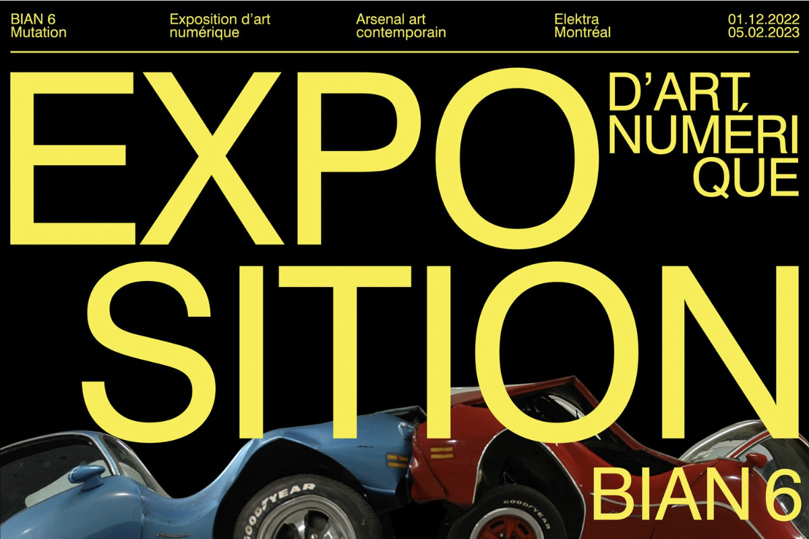

# Retour sur la visite de METAMORPHOSIS - 6e Biennale d'art numérique
## Informations sur l'exposition et la visite
***Nom de l'exposition:*** METAMORPHOSIS, 6e Biennale d'art numérique (BIAN)

***Lieu de mise en exposition:*** Arsenal, un centre d'art contemporain privé situé à Montréal. 

***Type d'exposition:*** Elle est temporaire et intérieure.

***Date de visite:*** La visite a eu lieu le 2 février 2023.

 

## L'oeuvre: nature morte 7

*Conçue par Baron Lanteigne

### Composantes

Les artiste ont utilisé trois projecteurs afin de pouvoir afficher le décor marin sur les murs de la petite pièce. Des hauts parleurs sont utilisés pour l'ambiance sonore de l'océan (bruits d'eau et d'animaux). Dans le centre de la pièce se trouve un ipad posé sur un support, où les visiteurs peuvent cliquer sur des boutons afin de faire apparaître des animations d'animaux marins en voie de disparition.

### Mise en exposition

### Intéractivité

L'installation invite le visiteur à la contourner afin de voir les deux côtés qu'elle représente: ce qu'on voit à l'écran et le hardware, une partie souvent cachée derrière l'écran et oublié par les utilisateurs. Le visiteur peut tourner autour de l'installation et observer comment elle fonctionne puisqu'aucun fil n'est caché. J'ai trouvé ce concept très intéressant et différent des autres installations qui cachent leurs parties électroniques car ce n'est "pas beau".

## Mes impressions sur l'exposition

### Ce que j'ai aimé

Mon oeuvre qui étaient réellement ma préférée était Breathing Patterns par Salomé Chatriot (je ne l'ai pas sélectionné dû au manque de composantes techniques). Tout d'abord elle m'a plu car je trouve que la façon dont elle a été animée est très hors du commun. En effet, les deux animations qui composent cette oeuvres ont été animées grâce à des données récoltées par un spiromètre (un capteur de respiration). L'artiste a animé la vidéo de droite avec une respiration tranquille et celle de gauche avec une respiration saccadée. Je trouve que cette idée sort de la norme et j'ai aimé la façon dont l'artiste a fait preuve de créativité. Ensuite, j'ai aimé l'oeuvre car son apparence me plait. C'est un style abstrait et organique qui me rappelle les créations de d'autres artistes que j'aime beaucoup (les robes de Iris Van Herpen, par exemple). Bref, ce qui m'a le plus plu est l'oeuvre de Salomé à cause de son ingéniosité et de son esthétique. 

### Ce que j'ai moins apprécié

Aspect que vous ne souhaiteriez pas retenir pour vos propres créations ou que vous feriez autrement et justifications | Personnellement, je trouve que les oeuvres qui s'éloignent trop de l'humain et de l'organique ne me plaisent pas. Par exemple, Copacabana Sex Machine et Restless sont deux oeuvres dans lesquelles les éléments principaux dansent de façon artificielle. Je ne suis pas habituée à voir des choses humanoides executer des mouvement saccadés et qui ne sont pas naturels, donc cela me créer une impression d'inconfort similaire au phénomène "uncanny valley" (une sorte de malaise face aux robots qui imitent les humains). Dans mes projets personnels, je ne vais pas incorporer de telles choses car elle ne me plaisent pas.

