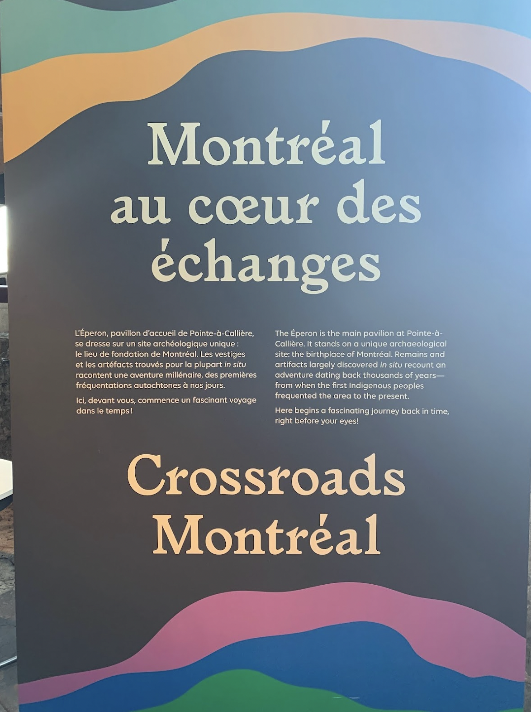
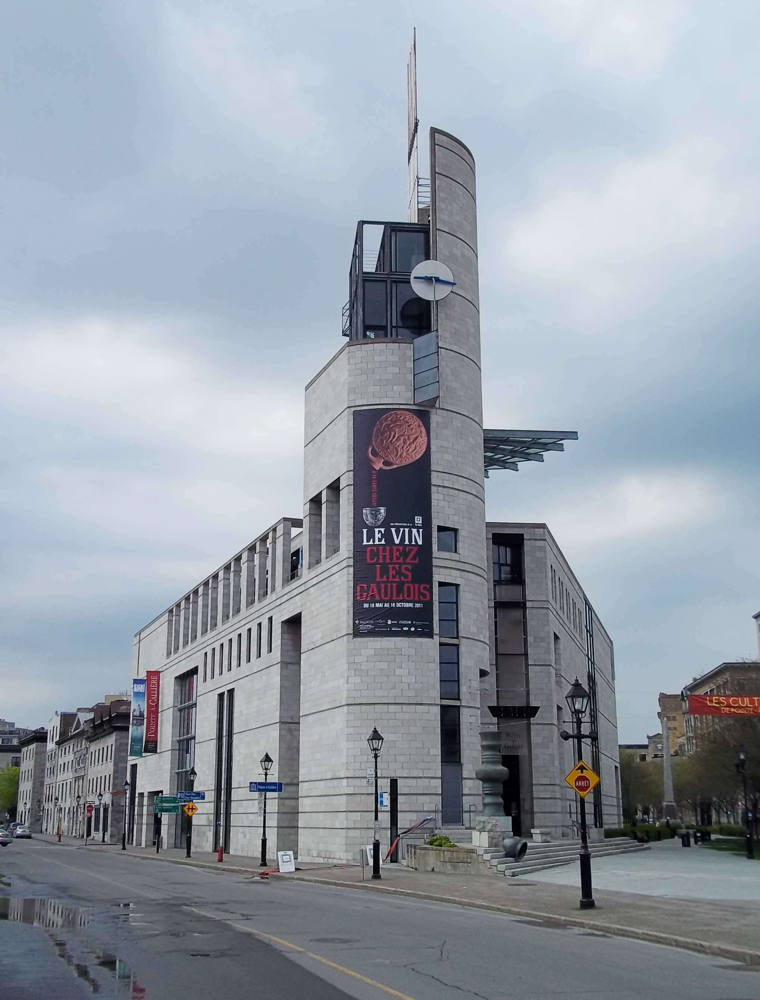
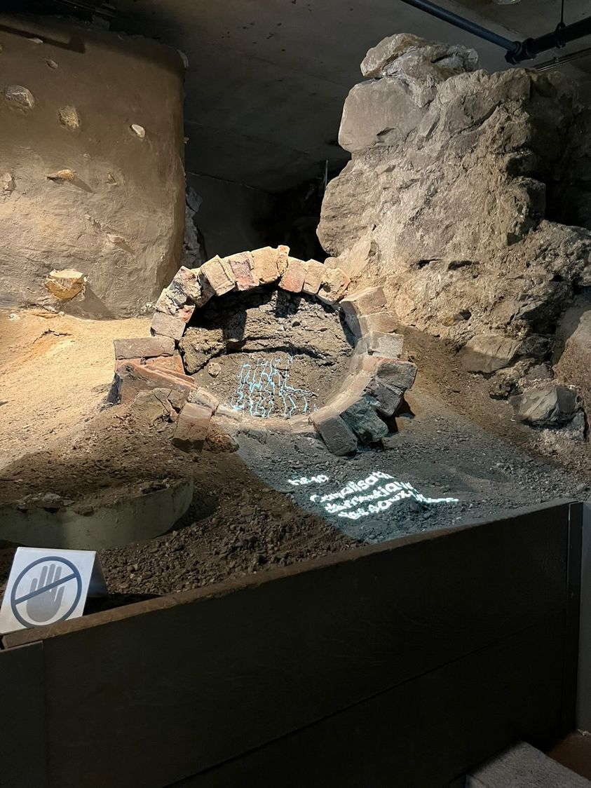
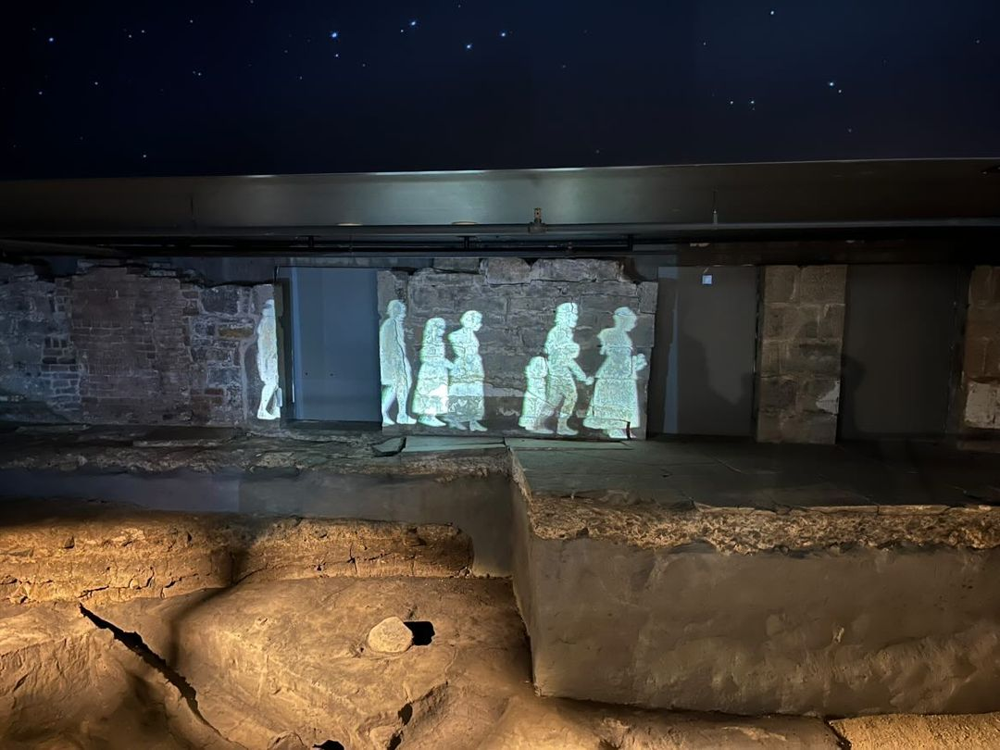
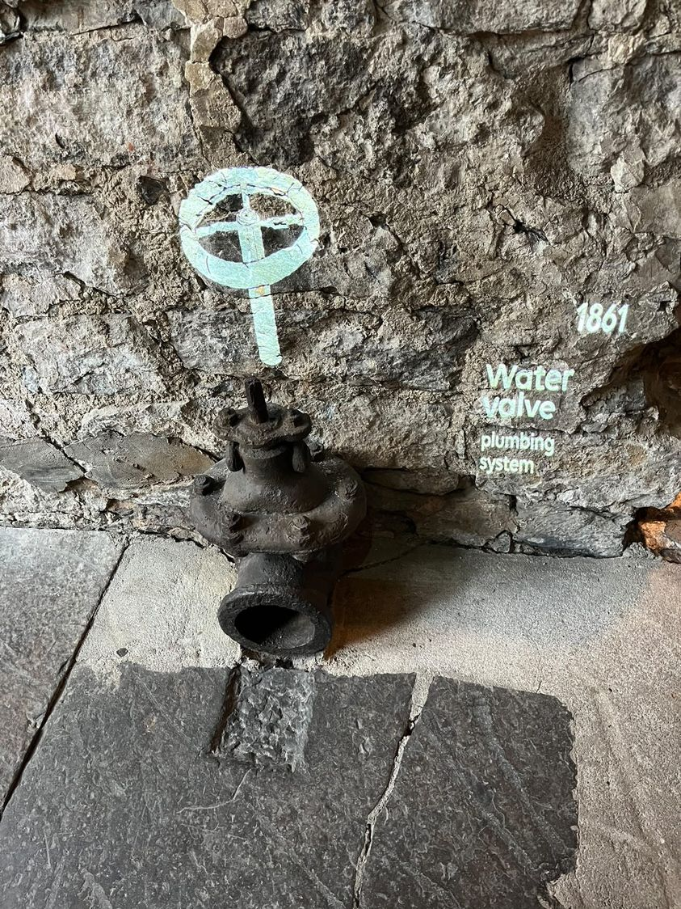
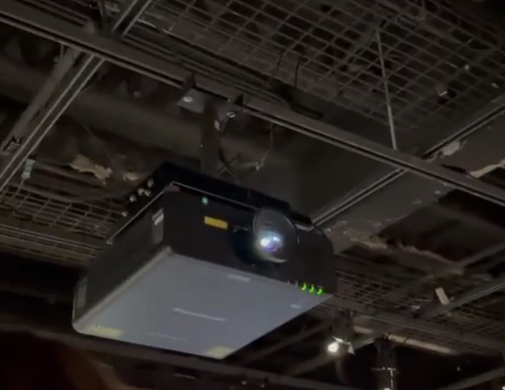

# Retour sur la visite du Musée de Pointe-à-Callière - Montréal au Coeur des échanges

## Informations sur l'exposition 
***Nom de l'exposition:*** Montréal au Coeur des Échanges

***Lieu de mise en exposition:*** Dans le sous-sol du Musée de Pointe-à-Callière, où se trouvent les vestiges de l'ancien marché central de Montréal. La visite consiste à faire découvrir l'histoire de ce lieu, de l'arrivée des chasseurs-cueilleurs sur le territoire du Vieux-Montréal à aujourd'hui. 

***Type d'exposition:*** Elle est permanente et intérieure

***Date de visite:*** Ma visite a eu lieu le vendredi 21 avril.

 Source: Jean Gagnon. "L'éperon de Pointe-à-Callière, Montréal", Wikipédia, "https://fr.wikipedia.org/wiki/Pointe-%C3%A0-Calli%C3%A8re,_cit%C3%A9_d%27arch%C3%A9ologie_et_d%27histoire_de_Montr%C3%A9al#/media/Fichier:Pointe-a-Calliere_2.jpg" 2022 

## L'oeuvre: Les projections du Marché Central

Conçue par GSM Project

Les dispositifs que j'ai sélectionnés sont des projections qui sont affichées directement sur le site archéologique afin d'y redonner de la vie et de transmettre des informations sur les anciennes infrastructures. Certaines projections simulent de l'eau qui coule des tuyaux ou bien des personnes qui marchent le long d'une arche.

[Vidéo](https://youtube.com/shorts/73GodWTeL10?feature=share)

### Composantes

Afin de créer ces dispositifs multimédias, des projecteurs sont vissés au plafond. Certaines projections sont créées à l'aide de plus d'un projecteur, puisqu'ils ont une surface irrégulière qui ne peut être correctement recouverte avec un unique appareil. Les fils qui les alimentent sont cachés dans des tubes au plafond afin de limiter leur présence. Pour la projection des gens qui marchent, l'image est affichée sur une vitre afin de créer un effet de profondeur entre les personnages et le décor de l'ancien Marché Central.

[Vidéo](https://youtu.be/_sPcfozcxhQ)

### Mise en exposition

La projection est sur la surface du tuyaux pour donner l'impression que de l'eau coule de celui-ci. 

### Intéractivité

Puisque que l'oeuvre est destinée à être contemplative, son interactivité est limitée. Toutefois, on peut remarquer un certain chemin qui relie les projections qu'on a tendance à suivre intuitivement. 

## Mes impressions sur l'exposition

### Ce que j'ai aimé
Ce que j'ai le plus aimé dans cette oeuvre, c'est la créativité du concept. Je trouve que les projections redonnent de la vie au site archéologique. Aussi, l'idée d'avoir des cartels projetés sur les surface diffère des cartel matériel classiques, ce que je trouve très original. 

### Ce que j'ai moins apprécié
L'élément que j'ai le moins apprécié dans Echomarine était que lorsqu'on cliquait sur des animaux trop vite, leurs animations et leurs effets sonores s'activaient tous en même temps et ça devenait cacophonique et surchargé. À leur place, j'aurais fait en sorte que les animations se mettent en file d'attente lorsque le visiteur est trop rapide.
